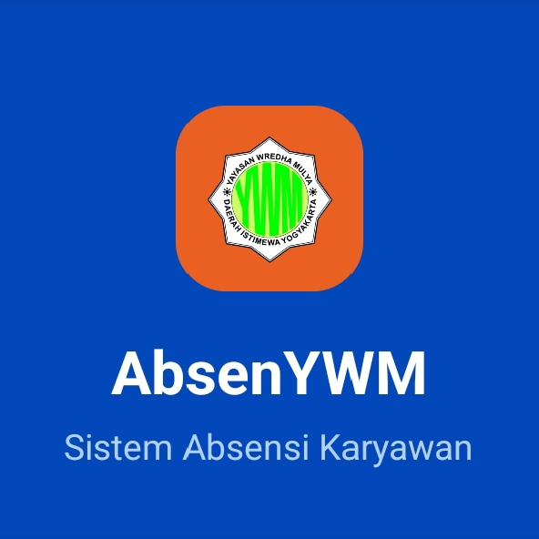
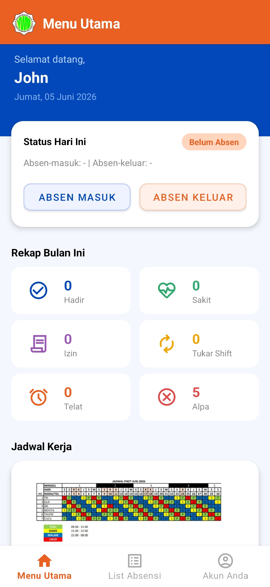
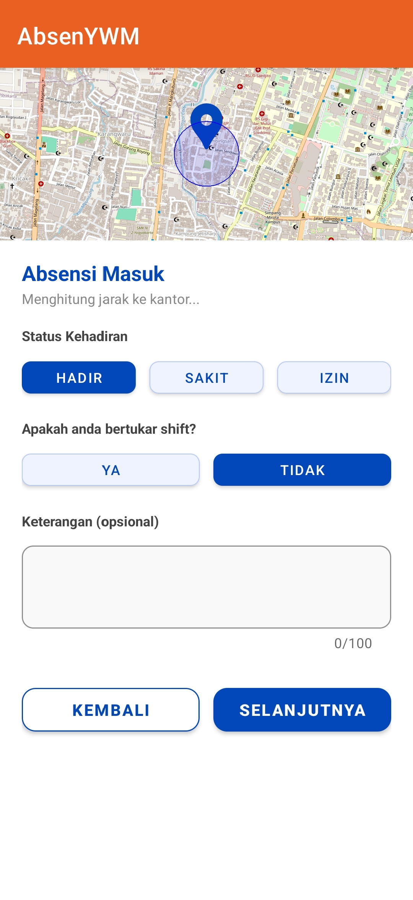
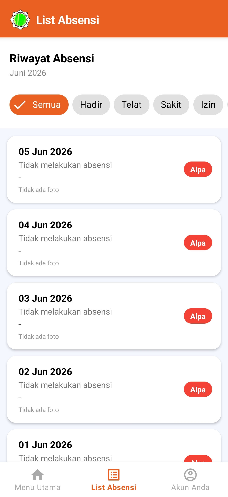
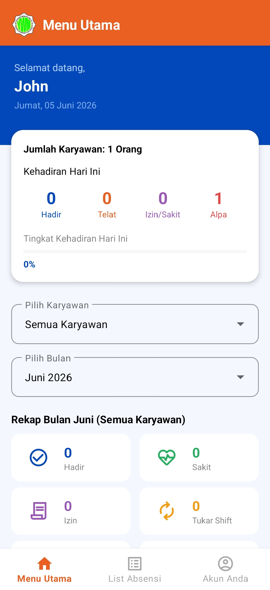
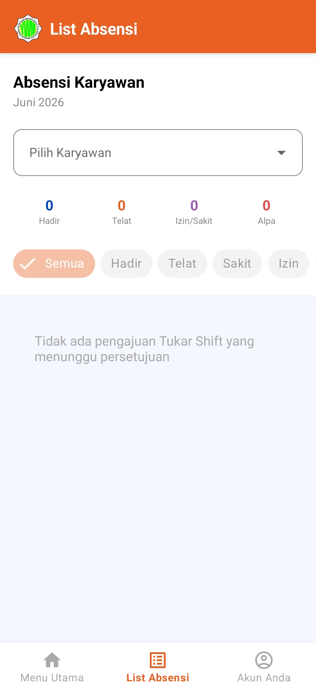
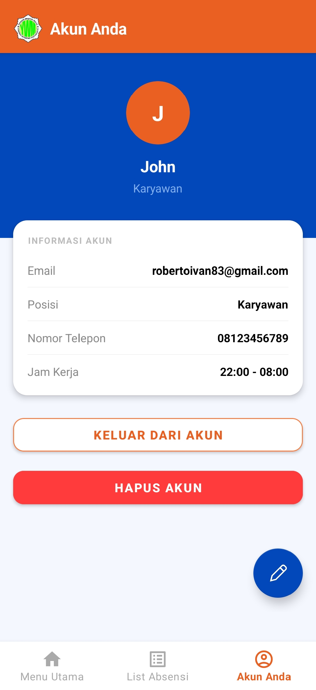

# **Yayasan Wredha Mulya Attendance App**  
`Role-Based Employee Attendance System with GPS Geofencing`

## 📌 Overview  
AbsenYWM is an Android-based employee attendance application built for Yayasan Wredha Mulya. The app supports two distinct user roles: Employee and Administrator. Each with a dedicated interface consisting of three screens: Home, Attendance List, and Account.

Attendance submission is verified through GPS geofencing and requires a selfie photo as proof. All data is recorded in real-time to Firebase Firestore, and administrators can monitor attendance statistics and export monthly reports as PDF files.

## 👨‍💻 Developed By
- `Ivan Roberto Halim`  

## ⚙️ Features  
### 👷 Employee
- 📍 Check-in & check-out with GPS geofencing validation
- 🤳 Selfie photo capture as attendance proof
- 🗺️ Interactive map showing live position and attendance zone (OpenStreetMap)
- 📋 Attendance status options: Present, Late, Sick, Permission, Shift Swap
- 📅 Monthly attendance history with status filter
- 📰 Work schedule viewer with image download
- 👤 Profile management with editable account info

### 🛡️ Administrator
- 📊 Real-time attendance dashboard (daily & monthly statistics)
- 👥 Full attendance list of all employees with photo proof links
- ✅ Shift swap approval system (approve / reject)
- 🖼️ Work schedule upload via Cloudinary
- 📄 Monthly attendance report export to PDF (iText)
- ➕ Employee and admin account management (create, edit)  

## 🧩 Core Modules  
- `LoginActivity` → Firebase Authentication with role-based routing
- `AbsensiActivity` → GPS geofencing, map display, and attendance submission
- `CameraActivity` → Selfie capture with FileProvider integration
- `AdminHomeFragment` → Dashboard statistics and PDF export engine
- `AdminListFragment` → Employee attendance viewer with shift swap approval
- `ListFragment` → Personal attendance history with filter chips
- `AccountFragment / AdminAccountFragment` → Profile view and account editing

## 🛠️ Tech Stack  
- 💻 Mobile Development: `Kotlin (Android)`
- 🔥 Authentication & Database: `Firebase Auth + Firestore`
- 🖼️ Media Storage: `Cloudinary`
- 🗺️ Maps & Location: `osmdroid (OpenStreetMap) + Google Fused Location API`
- 📄 PDF Generation: `iText PDF`
- 🖼️ Image Loading: `Glide`
- 🏗️ Architecture: `MVVM (ViewModel + LiveData)`
- 🧭 Navigation: `Navigation Component + Bottom Navigation`

## 🧠 How It Works  
1. App launches with **SplashActivity**, which checks the saved session and routes the user automatically
2. Unauthenticated users proceed to **LoginActivity** using Firebase Authentication
3. The system reads the `role` field from Firestore to route the user to either the **Employee** or **Admin** interface
4. **Employee submits attendance:**
   - Opens Absensi screen → GPS and map load automatically
   - If within 200 m of the office → attendance buttons are enabled
   - Employee selects status → takes a selfie → submission is saved to Firestore
5. **Admin monitors attendance:**
   - Dashboard displays today's and this month's breakdown by status
   - Can filter attendance records per employee or status
   - Can approve or reject shift swap requests
   - Can upload the work schedule image and export a PDF attendance recap 

## 📸 Project Showcase  

  
  
  
  
  
  

- Employee Home
- Attendance Screen
- Attendance History
- Admin Dashboard 
- Admin Attendance List
- Account Screen

## 📄 Notes  
This project was developed as a form of collaboration with Yayasan Wredha Mulya Yogyakarta, aiming to digitize and streamline the employee attendance process to support more efficient and accountable human resource management at the foundation.